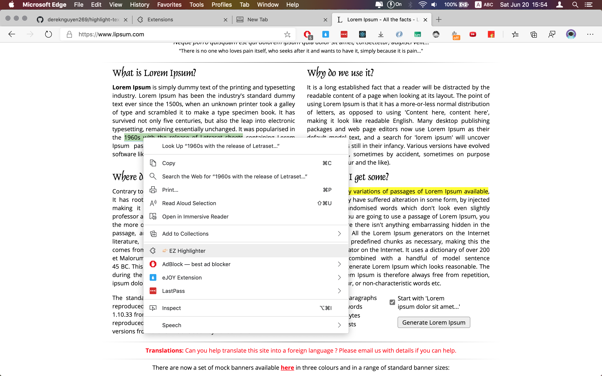

# EZ Highlighter

EZ Highlighter adds highlights to text on web pages, and tries to restore them on subsequent visits.
This is an extension that can highlight text on a web page, in a variety of styles. The highlighted text can be summarised, either as snippets or as full text.
The current page's highlights are listed by clicking on the '👉🏻EZ Highlighter' in the toolbar, along with other management functions, such as copying the highlight's text to the clipboard, or speaking the selected text. Further functions are available in the options page.

